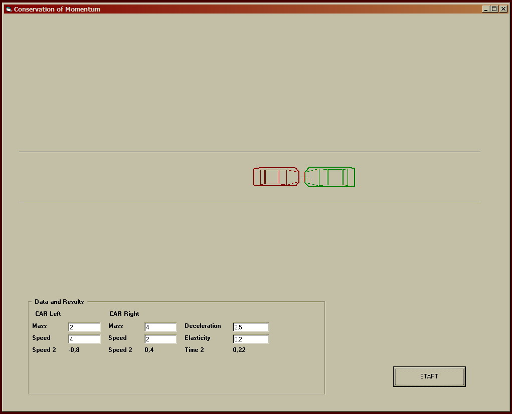



## Conservation of Momentum and Cars

### Description

Two cars collides. The reaction occurs just as expected using Linear Conservation of Momentum, elasticity an drag factor after collision. Inputs are mass of cars, speeds, elasticity an drag factor.
 
### More Info
 
Mass of cars, speeds, elasticity an drag factor on form.

Read code for explanations

Move cars and collides.

             |
---                |---
**Submitted On**   |2008-12-18 13:37:00
**By**             |[F\. Saverio Capaldo](https://github.com/Planet-Source-Code/PSCIndex/blob/master/ByAuthor/f-saverio-capaldo.md)
**Level**          |Intermediate
**User Rating**    |5.0 (10 globes from 2 users)
**Compatibility**  |VB 4\.0 \(32\-bit\), VB 5\.0, VB 6\.0
**Category**       |[Math/ Dates](https://github.com/Planet-Source-Code/PSCIndex/blob/master/ByCategory/math-dates__1-37.md)
**World**          |[Visual Basic](https://github.com/Planet-Source-Code/PSCIndex/blob/master/ByWorld/visual-basic.md)
**Archive File**   |[Conservati21374512182008\.ZIP](https://github.com/Planet-Source-Code/f-saverio-capaldo-conservation-of-momentum-and-cars__1-71538/archive/master.zip)

